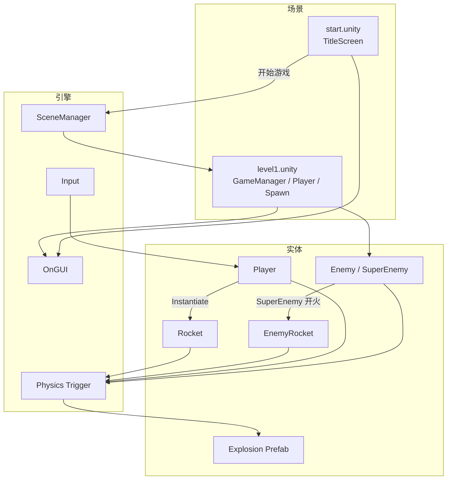
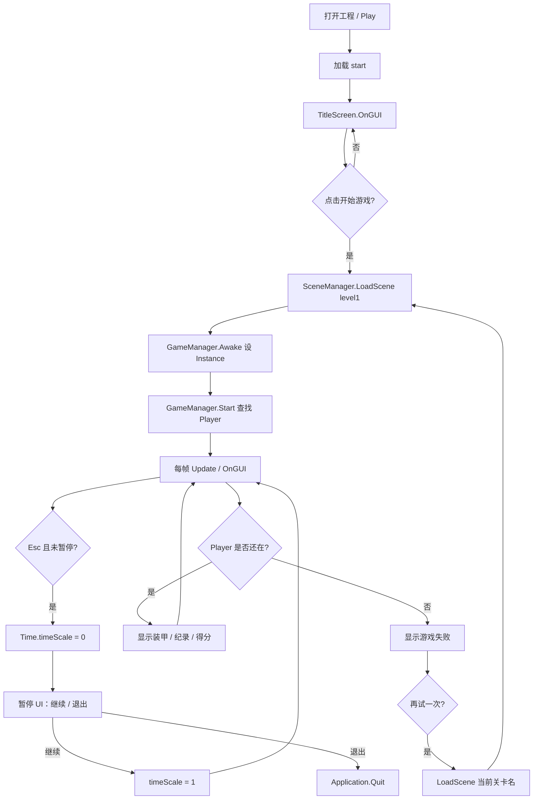
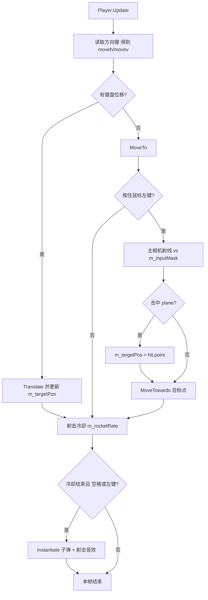
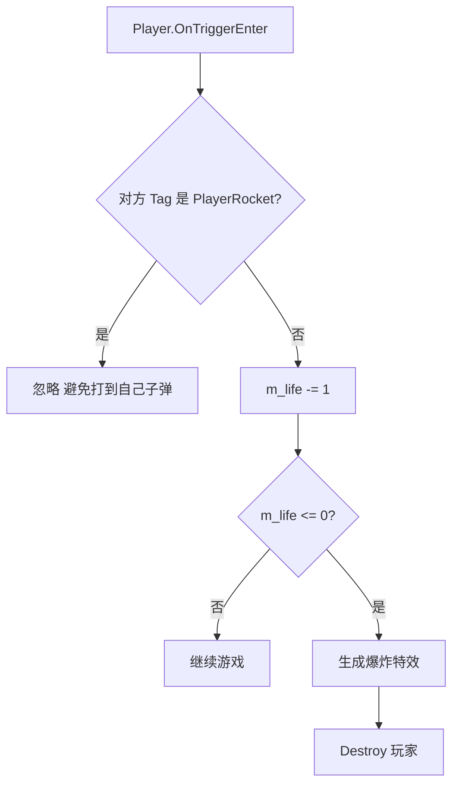
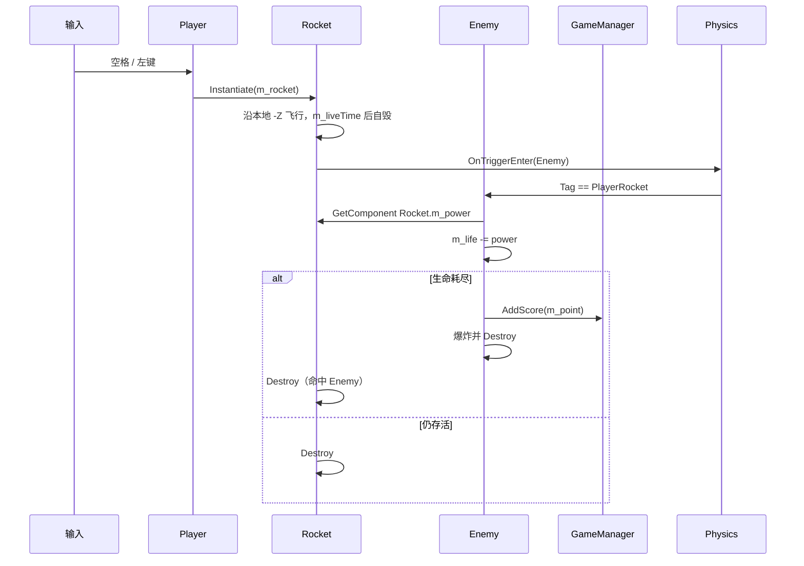
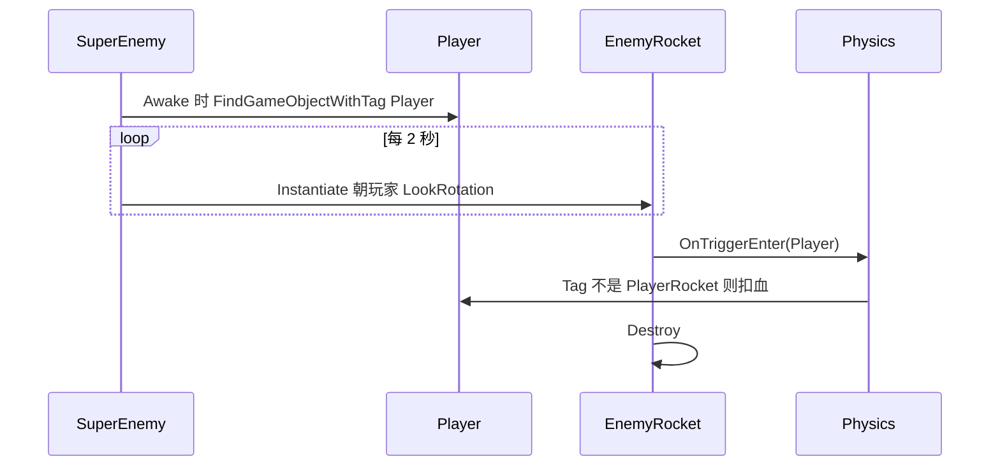
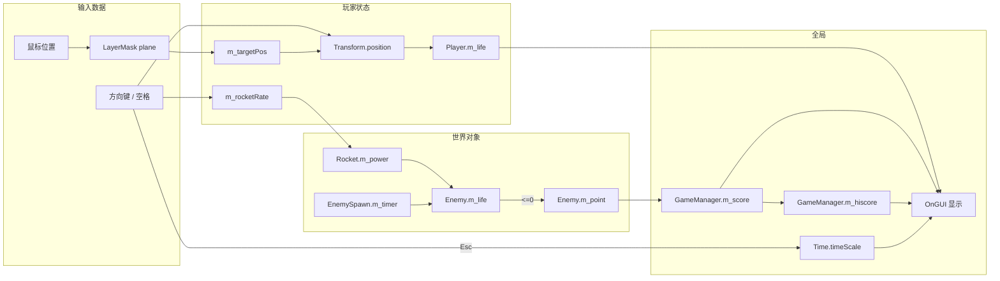
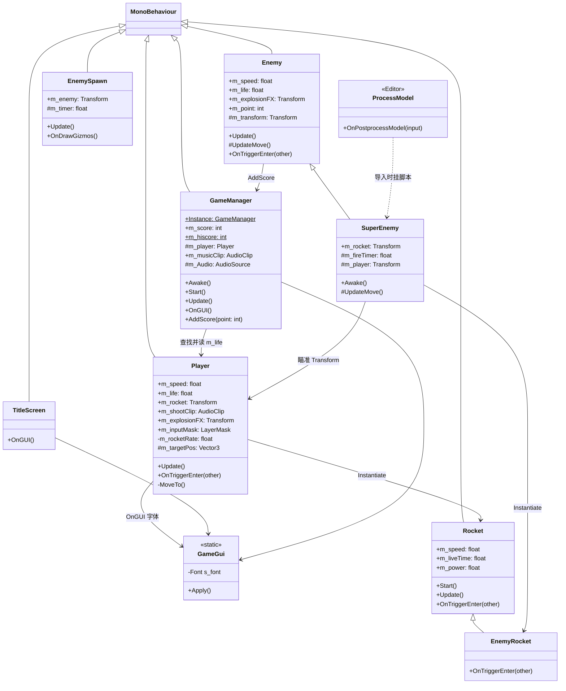
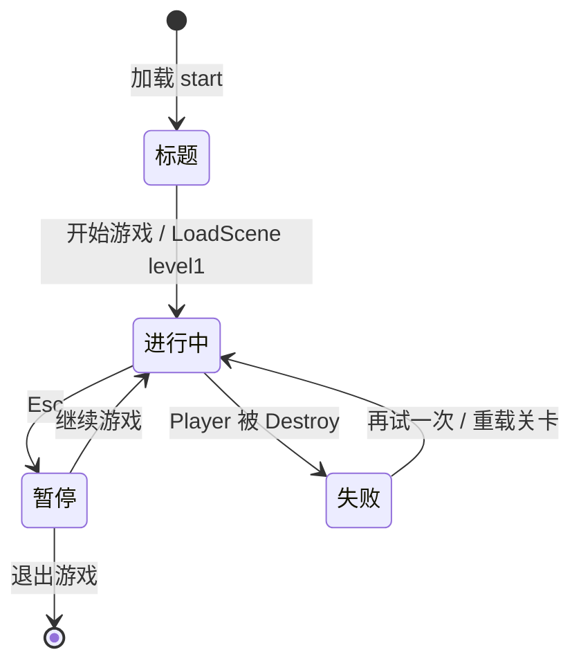
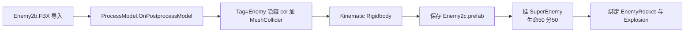

# ShootingGame（太空大战）

Unity 2022.3 竖版射击小游戏。玩家驾驶飞机躲避并击落敌机，用 IMGUI 显示生命、得分和暂停菜单。

- 引擎：Unity 2022.3.17f1c1（Built-in Render Pipeline）
- 入口场景：`Assets/start.unity` → 关卡 `Assets/level1.unity`
- 远程仓库：[AngryXZC/ShootingGame](https://github.com/AngryXZC/ShootingGame)

## Archify 图（可交互 HTML）

用全局 Agent Skill **Archify** 按源码生成，用浏览器打开即可缩放、切主题、导出：

| 类型 | 说明 | 打开 |
| --- | --- | --- |
| 架构 | 场景、脚本、物理 Trigger 如何接线 | [runtime.architecture.html](docs/archify/runtime.architecture.html) |
| 流程 | 玩家每帧：键盘优先、鼠标跟踪、开火 | [player-loop.workflow.html](docs/archify/player-loop.workflow.html) |
| 时序 | 玩家子弹命中敌人、加分、爆炸 | [combat.sequence.html](docs/archify/combat.sequence.html) |
| 数据流 | 生命、得分、最高分如何进 HUD | [score-life.dataflow.html](docs/archify/score-life.dataflow.html) |
| 生命周期 | 标题 → 进行中 → 暂停 / 失败 / 退出 | [session.lifecycle.html](docs/archify/session.lifecycle.html) |

规格 JSON 与 HTML 在同一目录。下面 Markdown 图是同一套逻辑的仓库内预览。

## 操作

| 输入 | 作用 |
| --- | --- |
| 方向键 | 移动飞机（优先于鼠标跟踪） |
| 按住鼠标左键 | 朝地面 `plane` 层射线落点飞行，同时开火 |
| 空格 / 鼠标左键 | 发射玩家子弹（间隔约 0.1 秒） |
| Esc | 暂停；界面可选继续或退出 |
| 失败后「再试一次」 | 重新加载当前关卡 |

标题页点「开始游戏」进入 `level1`。编辑器里请先点一下 Game 窗口，否则按键会被编辑器吃掉。

## 目录结构

```
Assets/
  Scripts/          运行时逻辑
  Prefabs/          飞机、子弹、刷怪点
  airplane/         模型与贴图
  FX/               爆炸、音效、BGM
  Editor/           模型导入后处理（仅编辑器）
  start.unity       标题
  level1.unity      关卡
ProjectSettings/    场景列表、Tag、Layer
Packages/           UGUI 与内置模块
```

运行时脚本一览：

| 脚本 | 挂载位置 | 职责 |
| --- | --- | --- |
| `TitleScreen` | `start` 场景 | 标题 UI，加载关卡 |
| `GameManager` | `level1` 场景 | 单例、分数、BGM、暂停/失败 UI |
| `Player` | 玩家飞机 | 移动、射击、受伤 |
| `Enemy` | 普通敌机 | 前进摆动、受击、出界销毁 |
| `SuperEnemy` | 精英敌机 | 继承 `Enemy`，朝玩家发射敌弹 |
| `EnemySpawn` | Spawn Prefab | 定时实例化敌人 |
| `Rocket` | 玩家子弹 | 飞行、命中 Enemy 后销毁 |
| `EnemyRocket` | 敌弹 | 继承 `Rocket`，命中 Player 后销毁 |
| `GameGui` | 静态工具 | IMGUI 使用系统中文字体 |
| `ProcessModel` | Editor | 导入 `Enemy2b` 时生成 `Enemy2c` Prefab |

---

## 1. 系统结构图

运行时由「场景管理 + 输入 + 物理触发 + IMGUI」四块组成，没有独立的网络或存档层。



---

## 2. 程序流程图（场景与游戏循环）

Build Settings 顺序：`start` → `level1`。`GameManager.m_hiscore` 是静态字段，重载关卡后最高分保留，当前分重置。



---

## 3. 玩家每帧控制流

键盘移动时会把 `m_targetPos` 同步到当前位置，避免再被鼠标跟踪拉回去。只有没有方向键输入时才走 `MoveTo()`。



受伤在物理回调里，不在 `Update` 中：



`GameManager` 下一帧发现 `m_player` 引用的对象已销毁，进入失败 UI。

---

## 4. 战斗时序图

玩家子弹打中敌人、敌人撞玩家、精英敌机开火三条路径。





敌人碰到 `bound` 只销毁自己、不加分、不爆炸。敌人碰到 `Player` 会爆炸并销毁自己；玩家侧同样因 Trigger 扣血。

---

## 5. 数据流图

分数、生命、生成计时器是核心数据。最高分跨场景重载仍在静态字段里。



### 碰撞 Tag 约定

物理全部走 Trigger。谁碰谁、改什么数据如下。

| 主动 / 对方 Tag | 处理脚本 | 数据变化 |
| --- | --- | --- |
| Player 碰到非 `PlayerRocket` | `Player` | `m_life - 1`，≤0 则销毁玩家 |
| Enemy 碰到 `PlayerRocket` | `Enemy` | `m_life -= Rocket.m_power`，≤0 则加分并销毁 |
| Enemy 碰到 `Player` | `Enemy` | 敌人直接销毁（爆炸） |
| Enemy 碰到 `bound` | `Enemy` | 敌人销毁，不加分 |
| Rocket 碰到 `Enemy` | `Rocket` | 子弹销毁 |
| EnemyRocket 碰到 `Player` | `EnemyRocket` | 敌弹销毁 |

玩家 Prefab Tag 为 `Player`，玩家子弹为 `PlayerRocket`，敌机为 `Enemy`，敌弹为 `EnemyRocket`，关卡边界为 `bound`。鼠标跟踪使用 Layer `plane`（bit 8，Mask 值为 256）。

---

## 6. 类图

继承很少：`SuperEnemy` / `EnemyRocket` 各扩一处行为。`GameManager` 通过单例被敌人调用。



---

## 7. 状态图（关卡生命周期）



`Time.timeScale = 0` 时 `Update` 中的位移与刷怪计时都会停，OnGUI 仍可点按钮。

---

## 8. 刷怪与编辑器导入流

关卡里的 `Spawn1` / `Spawn2` 调用 `EnemySpawn`：计时器到点后 `Instantiate(m_enemy)`，下次间隔为 `max(5, Random.value * 15)` 秒。



该后处理只在编辑器导入名为 `Enemy2b` 的模型时运行，不影响运行时。

---

## 9. 关键不变量（读代码时注意）

1. **移动互斥**：有方向键时不执行鼠标 `MoveTowards`，否则会把位移抵消回 `m_targetPos`。
2. **玩家忽略自己的子弹**：`Player.OnTriggerEnter` 用「不是 `PlayerRocket` 才扣血」，所以敌弹 Tag 必须是 `EnemyRocket` 或其它非玩家子弹 Tag。
3. **子弹销毁不负责扣血**：`Rocket` 只在碰到 `Enemy` 时自杀；扣敌方生命在 `Enemy` 里。
4. **失败判定**：不是显式 GameOver 标志，而是 `GameManager` 持有的 `Player` 组件所在对象被销毁。
5. **中文 UI**：`GameGui` 从系统字体创建 IMGUI Font；脚本需 UTF-8（建议带 BOM），否则标题会乱码。

---

## 本地打开

1. Unity Hub 用 **2022.3.17f1c1** 打开本目录。
2. 打开 `Assets/start.unity`，点 Play。
3. `Library/`、`Temp/`、`Logs/`、`UserSettings/` 已在 `.gitignore` 中，克隆后首次打开会重新导入。
